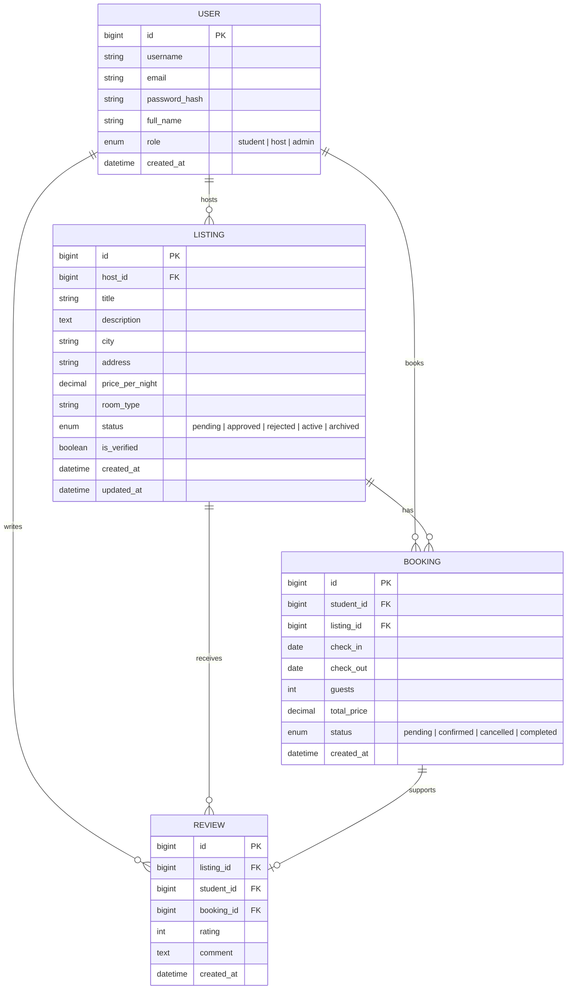

# COMP 3613 Assignment 1

Draft this file with the Guide. **Update it after every phase milestone** before you pause. The use-case diagram is a UML PNG at `docs/diagrams/use-case.png`, linked from this file as `diagrams/use-case.png` (path relative to `docs/report.md`). The model diagram is Mermaid. **Embed wireframe images** as `wireframes/<file>` (files live in `docs/wireframes/`).

Do not put your student ID in this file if you will commit it. The PDF cover adds your name and ID at export time.

## Assigned project

Student Accommodation

## Three workflows

### 1.

Book Accommodation (Student)

### 2.

List Accommodation (Host)

### 3.

Moderate Listings (Admin)

## Use case diagram

Phase 2 notes: Students browse and view listings as part of Book Accommodation. Hosts list accommodation, and Admins separately review pending listings; a listing must be approved before publication. The three use cases are started by their named actors, with no shared use case or «include» / «extend» relationship identified.

## Model diagram

First draft. Update this section in Phase 5 when polish revises the model, and note what changed.

Assumption: `User` handles the three roles (`student`, `host`, `admin`), so the admin is not a separate entity; listings move through a `status` workflow before publication, and `Review` requires a completed booking.

## Wireframes

### Shared entry

### Book Accommodation (Student)

### List Accommodation (Host)

### Moderate Listings (Admin)

Phase 4 notes: The shared entry screen covers a common login and role-selection path for the three actors. The student booking lane covers browsing, listing details, booking confirmation, and the completed review path. The host lane covers creating a listing, review, and managing incoming bookings. The admin lane covers the moderation queue, review of a listing, and the approval/rejection outcome path. The set is complete for all three named workflows; the remaining model note is that the listing lifecycle and booking lifecycle statuses should remain explicit in the ERD.

<!-- student-build:wireframe-coverage
use_case: Book Accommodation (Student)
image: docs/wireframes/Book accommodation lane.png
covered: yes
-->

<!-- student-build:wireframe-coverage
use_case: List Accommodation (Host)
image: docs/wireframes/List accommodation lane.png
covered: yes
-->

<!-- student-build:wireframe-coverage
use_case: Moderate Listings (Admin)
image: docs/wireframes/Moderate listings lane.png
covered: yes
-->

<!-- student-build:wireframe-coverage
use_case: Shared Entry / Role Access
image: docs/wireframes/Shared entry.png
covered: yes
-->

## Theming

Branding preferences and how they were applied (landing / login / register).

## Implementation notes

One named workflow at a time. Include verify notes and polish / model revisions (Phase 5). Do not treat the first build as final.

## Deployed app

Phase 6. Public Render URL (not localhost). Markers open this to mark the three workflows.

https://

## Logins

Every account a marker needs, including extra users you added. Starter accounts:

- bob / bobpass — regular user
- admin / adminpass — admin

## YouTube URL

## Session transcripts

Filled when the Guide builds the report: the agent writes each Guide chat to `docs/transcripts/<slug>.md` (Copilot Agent, Cursor, or OpenCode). `python manage.py report` packages them. Do not paste chats here during the build.

## Competency (student-judge)

Filled when the report is built. Guide runs student-judge, writes `docs/judge.md`, and export appends the scorecard here.

## Skill integrity

Filled by `python manage.py report`. Do not edit the course skills.
