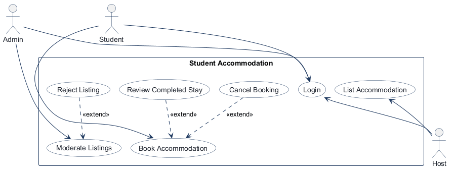
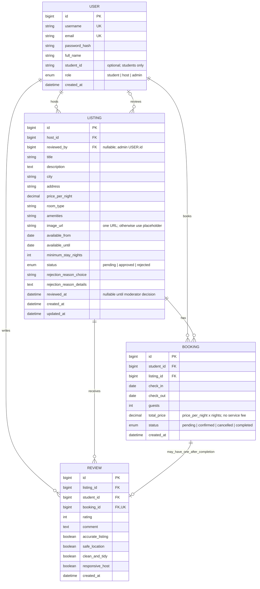

# COMP 3613 Assignment 1

Draft this file with the Guide. **Update it after every phase milestone** before you pause. The use-case diagram is a UML PNG at `docs/diagrams/use-case.png`, linked from this file as `diagrams/use-case.png` (path relative to `docs/report.md`). The model diagram is Mermaid. **Embed wireframe images** as `wireframes/<file>` (files live in `docs/wireframes/`).

Do not put your student ID in this file if you will commit it. The PDF cover adds your name and ID at export time.

## Assigned project

Student Accommodation

## Three workflows

### 1.

Book Accommodation (Student)

### 2.

List Accommodation (Host)

### 3.

Moderate Listings (Admin)

## Use case diagram

Use-case updates: `Login` is a shared use case for Student, Host, and Admin, matching the shared entry screen and the requested role-aware first screens. `Cancel Booking` and `Review Completed Stay` are «extend» use cases of `Book Accommodation` because they occur only on those conditional paths. `Reject Listing` is an «extend» use case of `Moderate Listings` because rejection is one possible moderation outcome. The three primary workflows remain unchanged.

## Model diagram

Revised in Phase 4 from the updated wireframes and the student's stated rules. Update again in Phase 5 if polish changes the model.

Rules: `User` handles the three roles (`student`, `host`, `admin`). `USER.student_id` is an optional student-only identifier; the booking form pre-fills it from the signed-in student's account. `BOOKING.student_id` remains the FK to `USER.id`, not the optional student identifier. A listing moves among `pending`, `approved`, and `rejected`; only `approved` listings are visible to students, and the VERIFIED badge means admin-approved (it is shown for every approved listing, not stored as a separate verification flag). Rejection stores a required reason choice and details; the host can edit and resubmit, which returns the listing to `pending`. On approval or rejection, `LISTING.reviewed_by` records the admin `USER.id` and `reviewed_at` records when the decision was made; both are unset before a moderation decision. An approved/live listing accepts booking requests; requests must fit the listing's available dates and minimum stay. `Booking.total_price` is nightly price multiplied by the number of nights, with no service fee. A confirmed booking becomes completed after its check-out date has passed. A completed booking may have at most one review (`REVIEW.booking_id` is unique); reviews contain a star rating, text, and the four shown yes/no tags. The listing's average rating is calculated from its reviews, not stored.

## Wireframes

### Shared entry

### Book Accommodation (Student)

### List Accommodation (Host)

### Moderate Listings (Admin)

Phase 4 notes: The shared Login use case, all three primary workflows, and the three conditional use cases are shown. The shared entry covers username/email login, Remember me, and role-aware destinations. The student lane shows browse/detail, booking request and confirmation, cancellation, and completed-stay review. The host lane shows listing creation/submission, statuses, rejection feedback, edit/resubmit, and incoming booking decisions. The admin lane shows the pending queue and approval/rejection with a required reason.

Model revisions from wireframe metadata: `LISTING.amenities`, `image_url`, `available_from`, `available_until`, and `minimum_stay_nights` are shown in the host listing form; booking checks use the available window and minimum stay. Rejection choice/details and the four review tags are shown in the admin and review screens and are represented in the model. The approved/rejected/pending lifecycle and single-review-per-completed-booking rule are explicit above.

Additional accepted model revisions: the optional student-only `USER.student_id` pre-fills the booking form; `LISTING.reviewed_by` and `reviewed_at` record the admin decision; `is_verified` was removed because the VERIFIED badge is derived from approved status.

Wireframe mismatches / scope notes (fix in Phase 5; no redraw needed):
- The student booking summary currently adds a service fee, but the agreed total is nightly price × nights only. Do not charge/display the fee in the working flow.
- The host dashboard labels an approved listing `ACTIVE`; the model has only `pending`, `approved`, and `rejected`. Use `approved` consistently; it means visible to students.
- The booking form's Student ID now comes from optional `USER.student_id`; `BOOKING.student_id` remains the foreign key to `USER.id`, not that optional identifier. The policy acknowledgement remains outside the working scope.
- The VERIFIED badge on browse/details means admin-approved, so display it for every listing whose status is `approved`; it is not a separately managed verification property.
- Admin outcome screens display reviewer and decision time, now represented by nullable-before-decision `LISTING.reviewed_by` and `reviewed_at`. The displayed MOD reference and audit history are not working features.
- Browse's search panel includes dates and guest count, while the agreed search is only area or room type; keep dates and guests in the booking-request form instead. Price/verification filters, map, favourites, and pagination are visual-only or omitted.
- Message host, support links, photo upload UI, availability calendar, save draft, archive, admin audit/history/export, and the trust checklist are out of scope as working controls. Use a single image URL or placeholder; keep the specified availability dates and minimum stay as listing data. Do not persist an `allow booking requests` setting: approved/live listings always accept requests.
- The booking wireframe includes the requested cancel path and completed review; the host lane includes edit/resubmit after rejection; the admin lane includes the required rejection reason. These paths agree with the requested model and use cases.

<!-- student-build:wireframe-coverage
use_case: Login
image: docs/wireframes/Shared entry.png
covered: yes
-->

<!-- student-build:wireframe-coverage
use_case: Book Accommodation (Student)
image: docs/wireframes/Book accommodation lane.png
covered: yes
-->

<!-- student-build:wireframe-coverage
use_case: Cancel Booking
image: docs/wireframes/Book accommodation lane.png
covered: yes
-->

<!-- student-build:wireframe-coverage
use_case: Review Completed Stay
image: docs/wireframes/Book accommodation lane.png
covered: yes
-->

<!-- student-build:wireframe-coverage
use_case: List Accommodation (Host)
image: docs/wireframes/List accommodation lane.png
covered: yes
-->

<!-- student-build:wireframe-coverage
use_case: Moderate Listings (Admin)
image: docs/wireframes/Moderate listings lane.png
covered: yes
-->

<!-- student-build:wireframe-coverage
use_case: Reject Listing
image: docs/wireframes/Moderate listings lane.png
covered: yes
-->

<!-- student-build:wireframe-coverage
use_case: Shared Entry / Role Access
image: docs/wireframes/Shared entry.png
covered: yes
-->

## Theming

Branding preferences and how they were applied (landing / login / register).

## Implementation notes

One named workflow at a time. Include verify notes and polish / model revisions (Phase 5). Do not treat the first build as final.

## Deployed app

Phase 6. Public Render URL (not localhost). Markers open this to mark the three workflows.

https://

## Logins

Every account a marker needs, including extra users you added. Starter accounts:

- bob / bobpass — regular user
- admin / adminpass — admin

## YouTube URL

## Session transcripts

Filled when the Guide builds the report: the agent writes each Guide chat to `docs/transcripts/<slug>.md` (Copilot Agent, Cursor, or OpenCode). `python manage.py report` packages them. Do not paste chats here during the build.

## Competency (student-judge)

Filled when the report is built. Guide runs student-judge, writes `docs/judge.md`, and export appends the scorecard here.

## Skill integrity

Filled by `python manage.py report`. Do not edit the course skills.
