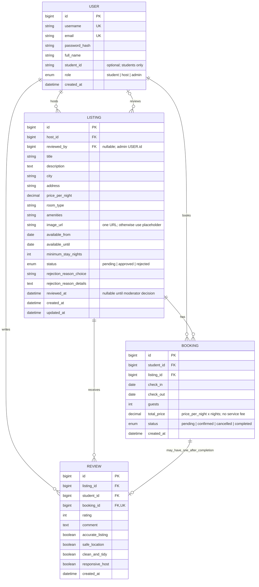
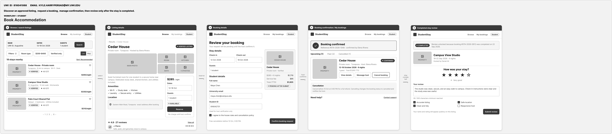
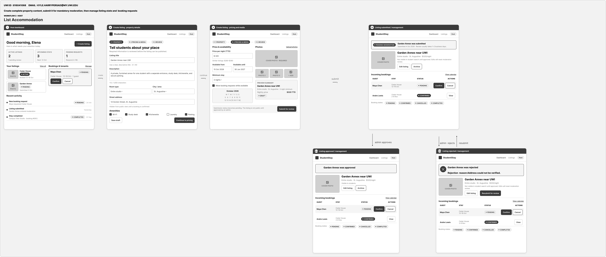
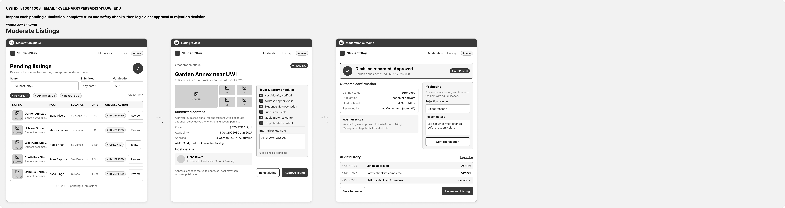
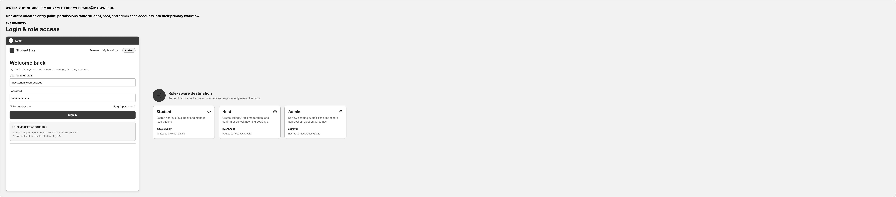

<!-- student-build:skill-integrity
status: pass
root: e84cd692d0b85eefe546385661958c27d07e8be6c5176a82012f68ccff5c8beb
expected_root: e84cd692d0b85eefe546385661958c27d07e8be6c5176a82012f68ccff5c8beb
mismatches: none
-->

# COMP 3613 Assignment 1

Draft this file with the Guide. **Update it after every phase milestone** before you pause. The use-case diagram is a UML PNG at `docs/diagrams/use-case.png`, linked from this file as `diagrams/use-case.png` (path relative to `docs/report.md`). The model diagram is Mermaid. **Embed wireframe images** as `wireframes/<file>` (files live in `docs/wireframes/`).

Do not put your student ID in this file if you will commit it. The PDF cover adds your name and ID at export time.

## Assigned project

Student Accommodation

## Three workflows

### 1.

Book Accommodation (Student)

### 2.

List Accommodation (Host)

### 3.

Moderate Listings (Admin)

## Use case diagram

Use-case updates: `Login` is a shared use case for Student, Host, and Admin, matching the shared entry screen and the requested role-aware first screens. `Cancel Booking` and `Review Completed Stay` are «extend» use cases of `Book Accommodation` because they occur only on those conditional paths. `Reject Listing` is an «extend» use case of `Moderate Listings` because rejection is one possible moderation outcome. The three primary workflows remain unchanged.

## Model diagram

Revised in Phase 4 from the updated wireframes and the student's stated rules. Update again in Phase 5 if polish changes the model.

Rules: `User` handles the three roles (`student`, `host`, `admin`). `USER.student_id` is an optional student-only identifier; the booking form pre-fills it from the signed-in student's account. `BOOKING.student_id` remains the FK to `USER.id`, not the optional student identifier. A listing moves among `pending`, `approved`, and `rejected`; only `approved` listings are visible to students, and the VERIFIED badge means admin-approved (it is shown for every approved listing, not stored as a separate verification flag). Rejection stores a required reason choice and details; the host can edit and resubmit, which returns the listing to `pending`. On approval or rejection, `LISTING.reviewed_by` records the admin `USER.id` and `reviewed_at` records when the decision was made; both are unset before a moderation decision. An approved/live listing accepts booking requests; requests must fit the listing's available dates and minimum stay. `Booking.total_price` is nightly price multiplied by the number of nights, with no service fee. A confirmed booking becomes completed after its check-out date has passed. A completed booking may have at most one review (`REVIEW.booking_id` is unique); reviews contain a star rating, text, and the four shown yes/no tags. The listing's average rating is calculated from its reviews, not stored.

## Wireframes

### Shared entry

### Book Accommodation (Student)

### List Accommodation (Host)

### Moderate Listings (Admin)

Phase 4 notes: The shared Login use case, all three primary workflows, and the three conditional use cases are shown. The shared entry covers username/email login, Remember me, and role-aware destinations. The student lane shows browse/detail, booking request and confirmation, cancellation, and completed-stay review. The host lane shows listing creation/submission, statuses, rejection feedback, edit/resubmit, and incoming booking decisions. The admin lane shows the pending queue and approval/rejection with a required reason.

Model revisions from wireframe metadata: `LISTING.amenities`, `image_url`, `available_from`, `available_until`, and `minimum_stay_nights` are shown in the host listing form; booking checks use the available window and minimum stay. Rejection choice/details and the four review tags are shown in the admin and review screens and are represented in the model. The approved/rejected/pending lifecycle and single-review-per-completed-booking rule are explicit above.

Additional accepted model revisions: the optional student-only `USER.student_id` pre-fills the booking form; `LISTING.reviewed_by` and `reviewed_at` record the admin decision; `is_verified` was removed because the VERIFIED badge is derived from approved status.

Wireframe mismatches / scope notes (fix in Phase 5; no redraw needed):
- The student booking summary currently adds a service fee, but the agreed total is nightly price × nights only. Do not charge/display the fee in the working flow.
- The host dashboard labels an approved listing `ACTIVE`; the model has only `pending`, `approved`, and `rejected`. Use `approved` consistently; it means visible to students.
- The booking form's Student ID now comes from optional `USER.student_id`; `BOOKING.student_id` remains the foreign key to `USER.id`, not that optional identifier. The policy acknowledgement remains outside the working scope.
- The VERIFIED badge on browse/details means admin-approved, so display it for every listing whose status is `approved`; it is not a separately managed verification property.
- Admin outcome screens display reviewer and decision time, now represented by nullable-before-decision `LISTING.reviewed_by` and `reviewed_at`. The displayed MOD reference and audit history are not working features.
- Browse's search panel includes dates and guest count, while the agreed search is only area or room type; keep dates and guests in the booking-request form instead. Price/verification filters, map, favourites, and pagination are visual-only or omitted.
- Message host, support links, photo upload UI, availability calendar, save draft, archive, admin audit/history/export, and the trust checklist are out of scope as working controls. Use a single image URL or placeholder; keep the specified availability dates and minimum stay as listing data. Do not persist an `allow booking requests` setting: approved/live listings always accept requests.
- The booking wireframe includes the requested cancel path and completed review; the host lane includes edit/resubmit after rejection; the admin lane includes the required rejection reason. These paths agree with the requested model and use cases.

<!-- student-build:wireframe-coverage
use_case: Login
image: docs/wireframes/Shared entry.png
covered: yes
-->

<!-- student-build:wireframe-coverage
use_case: Book Accommodation (Student)
image: docs/wireframes/Book accommodation lane.png
covered: yes
-->

<!-- student-build:wireframe-coverage
use_case: Cancel Booking
image: docs/wireframes/Book accommodation lane.png
covered: yes
-->

<!-- student-build:wireframe-coverage
use_case: Review Completed Stay
image: docs/wireframes/Book accommodation lane.png
covered: yes
-->

<!-- student-build:wireframe-coverage
use_case: List Accommodation (Host)
image: docs/wireframes/List accommodation lane.png
covered: yes
-->

<!-- student-build:wireframe-coverage
use_case: Moderate Listings (Admin)
image: docs/wireframes/Moderate listings lane.png
covered: yes
-->

<!-- student-build:wireframe-coverage
use_case: Reject Listing
image: docs/wireframes/Moderate listings lane.png
covered: yes
-->

<!-- student-build:wireframe-coverage
use_case: Shared Entry / Role Access
image: docs/wireframes/Shared entry.png
covered: yes
-->

### Book accommodation lane

### List accommodation lane

### Moderate listings lane

### Shared entry

## Theming

StudentStay uses a minimalist black-and-white theme: white background, `#F5F5F5` section surfaces, `#111111` text and primary buttons, `#6B6B6B` muted text, `#E0E0E0` borders, outlined secondary buttons, Inter type, and slightly rounded corners. No color accents, gradients, or decorative shadows. Status labels are distinguished with black fill, outline, grey, or a rejection X; image placeholders use light grey.

Applied to the public landing, login, register, session-expired page, and authenticated shell. The landing and auth screens carry the StudentStay wordmark and “Student housing you can trust.” tagline. Authenticated pages now use a light header and light page base.

## Implementation notes

One named workflow at a time. Include verify notes and polish / model revisions (Phase 5). Do not treat the first build as final.

Phase 5 initial slice: shared login accepts username or email; “Remember me” creates a persistent 30-day token/cookie, while unchecked login uses a browser-session cookie with the standard token expiry. Sign-in routes students, hosts, and admins to their respective current home screens. The host and student screens are placeholders until their workflow slices are built. `python manage.py init` seeds `maya.student`, `rivera.host`, and `admin01`, each with `StudentStay123`. Student verification: all three demo users signed in with username and email, role-specific first screens were correct, Remember me persisted only when checked, wrong-password feedback was clear, and the light Inter theme matched the wireframe. Polish note: add the wireframe navigation links as each role workflow is implemented (student Browse / My bookings; host Dashboard / Listings; admin Moderation / History).

List Accommodation decisions: use the wireframe's three-step listing form (property details → pricing/availability → review/submit), omit its visual-only draft/calendar/photo-upload controls, and include the dashboard booking-request list with Confirm/Cancel. Listing resubmission status coordination belongs in the service layer.

Host workflow implementation: the host dashboard and Listings page show listing statuses, rejection reasons, and incoming pending/confirmed bookings. Hosts can create a listing through the three-step form; new listings enter `pending` and remain hidden from students until approved. Rejected listings can be edited and resubmitted, which clears the prior decision metadata and returns the listing to `pending`. Hosts can confirm or cancel only their own pending booking requests. Role checks protect all host routes; SQL stays in repositories and transitions are coordinated by services.

`python manage.py init` and the `/config` initializer seed three approved listings, the pending `Garden Annex near UWI` for `rivera.host`, one pending request, one upcoming confirmed booking, and one past confirmed booking. The past booking is marked completed when the host booking service next loads it; the student review workflow will reuse that transition. Rejected-listing resubmission can be exercised after the Moderate Listings workflow creates a rejected record. The student reported that the Host dashboard and Listings page looked good overall. Follow-up polish formats listing prices to two decimal places and keeps the Host navigation visible on every host view; the student later confirmed that Host prices display to two decimal places.

Moderate Listings implementation: the Admin dashboard now lists pending submissions and opens a listing review page. Approval changes the status to `approved`; rejection requires a selected reason and details. Both decisions record `reviewed_by` and `reviewed_at`. The outcome page shows the decision metadata and rejection feedback. `VERIFIED` is rendered from `status == "approved"` rather than stored separately. Admin navigation includes Moderation and a non-functional History link; the audit-history feature remains out of scope. The student selected a fixed rejection-reason dropdown plus required details.

The Admin code checks surfaced route/service/repository interface and editing issues; the status constraint and service logic were reviewed, the repository method indentation was corrected after the student's attempt, and the final route variable names were aligned to the scaffold. The student verified that the database reinitializes cleanly, approvals and rejections work with required-field validation, and decision metadata renders correctly.

<!-- student-build:code-check
workflow: Moderate Listings (Admin)
form: choice
layer: other
architecture_ok: yes
implement_confidence: 0.58
passed: yes
note: Chose a fixed rejection-reason dropdown with required explanatory details.
-->

<!-- student-build:code-check
workflow: Moderate Listings (Admin)
form: snippet
layer: model
architecture_ok: yes
implement_confidence: 0.58
passed: yes
note: Added a database check constraint limiting Listing.status to pending, approved, or rejected; table creation confirmed the constraint is present.
-->

<!-- student-build:code-check
workflow: Moderate Listings (Admin)
form: snippet
layer: repository
architecture_ok: yes
implement_confidence: 0.48
passed: partial
note: Implemented the status/reviewer/timestamp persistence and refresh; Guide corrected method indentation after repeated misalignment.
-->

<!-- student-build:code-check
workflow: Moderate Listings (Admin)
form: snippet
layer: service
architecture_ok: yes
implement_confidence: 0.48
passed: partial
note: Implemented pending-only decisions, rejection-field validation, and repository delegation; Guide restored list/detail service methods removed during the student's edit.
-->

<!-- student-build:code-check
workflow: Moderate Listings (Admin)
form: snippet
layer: router
architecture_ok: yes
implement_confidence: 0.48
passed: partial
note: Route uses AdminDep and a repository-backed service with no SQL; Guide aligned the final admin and decision arguments after attempted edits remained inconsistent.
-->

Host polish: Host dashboard and listing-card prices now show two decimal places, and Host navigation is shared through the authenticated base across host views. Approved Host cards show `VERIFIED` based on listing status. The Admin navigation and moderation screens were verified against the working approval/rejection flow; History remains visual-only.

Book Accommodation decisions: allow students to cancel both pending and confirmed upcoming bookings. The student identified service-level checks for listing approval, valid dates, and booking conflicts, with persistence delegated to the repository. Student-specific navigation and protected routes are implemented.

Book Accommodation implementation: the student Browse page searches approved listings by area or room type, listing detail pages show reviews and a calculated average, and the booking form pre-fills the account name, email, and student ID. Booking requests are pending, use price-per-night × nights, and are checked against approval, availability, minimum stay, and overlapping pending/confirmed bookings. My bookings supports upcoming, past, and cancelled views, with cancellation for pending and confirmed stays before check-in. Past confirmed bookings become completed after checkout; only completed bookings without an existing review can be reviewed once. Reviews store the star rating, written text, and four ERD yes/no tags. Student navigation links Browse and My bookings. The seeded Maya account receives a demo student ID for the prefilled form.

Targeted checks confirmed ORM mapping/table creation including the unique review-per-booking constraint, route registration and template parsing, and service calculation of a pending 3-night booking at $320/night to $960.00 while rejecting an unavailable listing. Route-level checks exposed and fixed booking-page 500s caused by passing query parameters to Starlette's path-only template `url_for`; status-tab links and the review return path now encode query strings correctly. Listing search now matches each query word against approved listing titles, cities, addresses, or room types and handles punctuation such as `St. Augustine`. An isolated HTTP test-client pass verified search, empty and past booking pages, booking submission and redirect, and the review return redirect. The student then confirmed search, My Bookings, and booking submission work as expected when run locally.

<!-- student-build:code-check
workflow: Book Accommodation (Student)
form: choice
layer: other
architecture_ok: yes
implement_confidence: 0.58
passed: yes
note: Chose cancellation for both pending and confirmed upcoming bookings.
-->

<!-- student-build:code-check
workflow: Book Accommodation (Student)
form: mcq
layer: service
architecture_ok: yes
implement_confidence: 0.58
passed: yes
note: Identified the service as the place to coordinate booking eligibility when listing approval changes.
-->

<!-- student-build:code-check
workflow: Book Accommodation (Student)
form: open
layer: service
architecture_ok: yes
implement_confidence: 0.60
passed: yes
note: Explained service checks for listing approval, dates, and conflicts; repository validates/persists the booking data.
-->

<!-- student-build:code-check
workflow: Book Accommodation (Student)
form: snippet
layer: model
architecture_ok: yes
implement_confidence: 0.46
passed: partial
note: Final Review fields and one-review-per-booking uniqueness match the ERD after an initial schema/table/FK naming mismatch and a required correction pass.
-->

<!-- student-build:code-check
workflow: Book Accommodation (Student)
form: snippet
layer: router
architecture_ok: yes
implement_confidence: 0.46
passed: yes
note: The booking route delegates to StudentStayService and passes listing, student, dates, and guests; Guide corrected two inconsistent identifiers from the attempted revision.
-->

<!-- student-build:code-check
workflow: Book Accommodation (Student)
form: snippet
layer: repository
architecture_ok: yes
implement_confidence: 0.46
passed: partial
note: Completed overlap checking for pending/confirmed bookings and commit/refresh persistence; remaining repository methods were implemented as workflow glue.
-->

<!-- student-build:code-check
workflow: Book Accommodation (Student)
form: snippet
layer: service
architecture_ok: yes
implement_confidence: 0.46
passed: partial
note: Final request_booking checks approval, date window, minimum stay, conflicts, and total price; required a second pass to align method and field names with the model/repository.
-->

<!-- student-build:code-check
workflow: List Accommodation (Host)
form: choice
layer: other
architecture_ok: yes
implement_confidence: 0.95
passed: yes
note: Selected the three-step create-listing flow with the specified visual-only controls omitted.
-->

<!-- student-build:code-check
workflow: List Accommodation (Host)
form: choice
layer: other
architecture_ok: yes
implement_confidence: 0.95
passed: yes
note: Included incoming booking requests and Confirm/Cancel in the host slice.
-->

<!-- student-build:code-check
workflow: List Accommodation (Host)
form: mcq
layer: service
architecture_ok: yes
implement_confidence: 0.95
passed: yes
note: Identified the service layer for coordinating rejected-listing resubmission status.
-->

<!-- student-build:code-check
workflow: List Accommodation (Host)
form: snippet
layer: model
architecture_ok: yes
implement_confidence: 0.92
passed: yes
note: Completed Listing SQLModel fields and host/reviewer foreign-key relationships to match the ERD.
-->

<!-- student-build:code-check
workflow: List Accommodation (Host)
form: snippet
layer: router
architecture_ok: yes
implement_confidence: 0.92
passed: yes
note: Completed a thin create route that binds ListingCreate and calls ListingService; aligned the service import to the existing listing_service module.
-->

## Deployed app

Phase 6 complete — deployed via Render Blueprint. The public app is live, and its `/health` endpoint returns `{"ok":true}`. Markers can open the app to mark the three workflows.

[https://faststarter-a406.onrender.com](https://faststarter-a406.onrender.com)

## Logins

Every account a marker needs, including extra users you added:

- maya.student or [maya.chen@campus.edu](mailto:maya.chen@campus.edu) / StudentStay123 — student
- rivera.host or [elena.rivera@campus.edu](mailto:elena.rivera@campus.edu) / StudentStay123 — host
- admin01 or [admin01@campus.edu](mailto:admin01@campus.edu) / StudentStay123 — admin

## YouTube URL

[https://youtu.be/bcQhgtsQ3sQ](https://youtu.be/bcQhgtsQ3sQ)

## Session transcripts

Filled when the Guide builds the report: the agent writes chat markdown into `docs/transcripts/`; `python manage.py report` packages them.

Guide packaged **4** chat(s) in `docs/transcripts/` (and `docs/transcripts.zip`).

Index: [docs/transcripts/INDEX.md](transcripts/INDEX.md)

- [`phase-6-deploy-and-report`](transcripts/phase-6-deploy-and-report.md)
- [`phase-6-render-mcp-check`](transcripts/phase-6-render-mcp-check.md)
- [`phase-6-render-mcp-start`](transcripts/phase-6-render-mcp-start.md)
- [`phase-6-render-session-setup`](transcripts/phase-6-render-session-setup.md)

## Competency (student-judge)

Filled by Guide from the student-judge run when this report was built.

**Judged at:** 2026-10-09T17:15:00-04:00
**Student / session:** COMP 3613 student / Copilot Agent workspace sessions
**Artifact:** Current `docs/report.md`, diagrams, wireframes, accessible native Phase 6 chat, and workspace session metadata
**Phases in evidence:** 1–6 (COMP 3613; Phase 5 polish, Phase 6 deploy; never generic 0–5)
**Evidence limitation (tool access, not student omission):** The student can see the earlier Phase 1–5 chats in the VS Code chat-history UI, and a screenshot confirmed that the chats are present. In this assessment session, the chat-history retrieval tool returned empty histories for those older sessions, and no earlier transcript markdown was available to the exporter. This is a tooling/access limitation, not evidence that the student failed to keep or provide the chats. Scores for those phases rely on the contemporaneous project report and code-check records, not reconstructed chat.

### Totals

| | Count / value |
|--|--|
| Metrics on rubric | 12 (M1–M12) |
| N/A (excluded) | 0 |
| Metrics scored | 12 |
| Scoreable max | 12 × 4 |
| Awarded total | 37 / 48 |
| **Overall (avg of scored)** | **3.08 / 4** |
| Impression confidence | 0.77 / 1.00 (calculated from overall; no Guide confidence log available) |
| Impression mark | 15 / 20 |

## Scorecard

| ID | Metric | Score / 4 | In avg | Evidence |
|----|--------|----------:|:------:|----------|
| M1 | Phase discipline | 3 | yes | Report and workspace session titles show progression through Phases 1–6; it records Phase 5 polish before deployment. Historical turns were unavailable. |
| M2 | Problem framing | 3 | yes | Report contains the assigned project, three named workflows, shared and conditional use cases, student-named entities, and model rules. |
| M3 | Decision ownership | 3 | yes | Report records student decisions for booking cancellation, rejection reasons, model revisions, and workflow scope. These records are not a substitute for inaccessible earlier turns. |
| M4 | Artefact-before-code | 4 | yes | The report states the model was “Revised in Phase 4 from the updated wireframes and the student's stated rules”; the use-case diagram and four wireframe images are present. |
| M5 | Verification habit | 3 | yes | Report records local verification of booking, host, admin, and login flows and subsequent UI/workflow polish. |
| M6 | Assignment fit | 3 | yes | Phase 5 notes describe ERD-aligned models and thin service-delegating routes; a source search found no inline persistence queries in `app/routers/`. |
| M7 | Slice explanation | 3 | yes | Code-check records capture service/repository reasoning and attempts at model, route, repository, and service snippets, including correction passes. |
| M8 | Prompt quality | 3 | yes | Workspace session titles and the accessible chat are phase-oriented; the current request cleanly asks to finalize the report after adding the video link. |
| M9 | Response to pushback | 3 | yes | Report records continued iteration after verification, including price formatting, navigation consistency, booking-route fixes, and search behavior. |
| M10 | Integrity | 3 | yes | No laundering flags or protected skill edits were found in accessible evidence. Earlier turns and a generated skill-integrity result were not available to re-check. |
| M11 | Provenance continuity | 3 | yes | The report maintains a coherent chain from Student Accommodation workflows through the model, wireframes, implementation, polish, and deployment. |
| M12 | Sincerity trajectory | 3 | yes | No sincerity protocol was triggered in the accessible Phase 6 chat; earlier chat histories were unavailable, so trajectory evidence is incomplete. |

## Strengths

- The project report contains aligned workflows, an ERD, a UML use-case diagram, and wireframes covering the named use cases.
- Phase 5 includes student verification notes and iterative polish rather than stopping at the first build.
- Code-check records show layered architecture attempts, and the router source search found no persistence queries in route modules.
- The public Render URL, marker logins, and YouTube presentation link are now recorded.

## Gaps (priority order)

- No confirmed student gap from accessible evidence. The prior Phase 1–5 chats are visible to the student in VS Code, but this tool session could not retrieve their message histories; this should not be attributed to the student.

## Phase gate status

| Phase | Status | Note |
|-------|--------|------|
| 1 | met | Assigned project and three workflows are recorded in the report. |
| 2 | met | Use-case diagram is present; report documents shared login and conditional use cases. |
| 3 | met | ERD and relationship/business-rule notes are present. |
| 4 | met | Four workflow wireframes are embedded and use-case coverage is recorded. |
| 5 | met | Theme, implementation notes, code checks, verification, and follow-up polish are recorded. |
| 6 | met | Public Render URL and marker logins are recorded; the accessible chat confirms manual deployment via Render Blueprint. |

## Recommended next practice

- Review the export PDF and confirm that its cover details, app link, marker credentials, video link, diagrams, and transcript appendix are correct.

## Integrity note

- Clean in accessible evidence; historical Phase 1–5 chat turns could not be reviewed in this pass.

## Provenance flags

- The retrieval tool returned empty histories for earlier Guide chats despite their visible presence in the student's VS Code history; prior phase transcript files were not accessible to the exporter in this session.

## Sincerity log summary

- Blocks found: 0 in accessible evidence | max round: N/A | min/mean/final confidence: N/A | trend: N/A | cleared: no suspicion observed in accessible evidence; historical trajectory unavailable because of tool access limitation

## Skips

- Skips: 0/3 recorded in `docs/report.md`; earlier phase turns were unavailable, so this count is provisional. Skips are not an integrity failure.

## Skill integrity

Course skills are hashed at export and compared to `.agents/skills.lock.json`. Do not edit `.agents/skills/`, `.cursor/skills/`, or `AGENTS.md`.

- Status: **pass**
- Root: `e84cd692d0b85eefe546385661958c27d07e8be6c5176a82012f68ccff5c8beb`
- none
